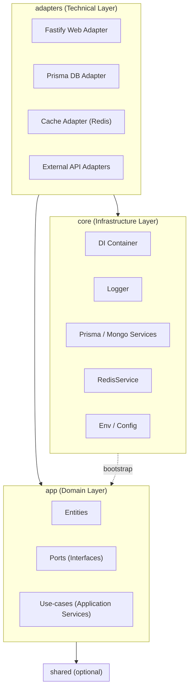

# ModularHexaTemplate

Hexagonal Architecture（Ports & Adapters）+ Modular Monolith 的 Node.js / TypeScript 後端模板。

核心理念：

- Modular：每個 domain 自成子系統
- Maintainable：清晰邊界，降低耦合
- Extensible：可替換技術實作（Web/DB/Cache/Queue）
- Domain-Driven：Domain 與技術分離（Domain Separation）

---

## 📋 目錄

- [📝 專案介紹](#-專案介紹)
- [📂 專案結構](#-專案結構)
- [🔤 檔案命名規則](#-檔案命名規則)
- [🏗 各層職責](#-各層職責)
- [🧭 依賴方向與規則](#-依賴方向與規則)
- [🎯 設計目標總結](#-設計目標總結)
- [🗺 架構圖](#-架構圖)
- [🚀 未來規劃](#-未來規劃)

---

## 📝 專案介紹

ModularHexaTemplate 以 Domain 與技術解耦為首要目標，將系統分為 `app`（Domain 層）、`adapters`（Web/DB/Cache/External 等技術層）以及
`core`（Infrastructure 層）。

此模板特別適合：

- 想要在單體架構內維持清晰模組邊界的團隊
- 需要同時支援 Fastify、Prisma、Redis 等技術適配的專案
- 想將 Domain 邏輯沉澱為可重用套件的場景

---

## 📂 專案結構

`${domain}` 代表任一業務模組（如：member、ticket、auth）。

```
├── index.ts                # Application entry point（啟動 DI、Fastify、註冊 routes）
├── node_modules/
├── src/
│   ├── app/                # Domain 層（純業務邏輯，不依賴任何技術）
│   │   ${domain}/
│   │     ├── entities/     # Domain Entities / Value Objects
│   │     ├── ports/        # Repository / Gateway interfaces
│   │     └── use-cases/    # 用例（Application Services）
│   │
│   ├── adapters/           # 技術邊界與 Port 實作（HTTP / DB / Cache / Queue）
│   │   ├── fastify/
│   │   │   ${domain}/
│   │   │     ├── routes/   # Fastify route 註冊
│   │   │     ├── controllers/ # HTTP handlers
│   │   │     └── dto/      # Request / Response DTO schema
│   │   ├── prisma/
│   │   │   ${domain}/
│   │   │     └── *.repository.ts # Repository 實作（依賴 PrismaService）
│   │   ├── cache/
│   │   │   ${domain}/
│   │   │     └── *.cache.ts # Cache 實作（依賴 RedisService）
│   │   └── external/        # 依需求選用，非每個 domain 都一定要有
│   │       ${domain}/
│   │         └── *.adapter.ts # 外部 API Adapter
│   │
│   ├── core/               # 平台層（Infrastructure / DI / Env / Logger）
│   │   ├── di/
│   │   │   ├── container.ts
│   │   │   ├── tokens.ts
│   │   │   └── global-configs.ts
│   │   ├── logger/
│   │   │   ├── logger.service.ts
│   │   │   └── job-logger-factory.service.ts
│   │   ├── db/
│   │   │   ├── prisma-config.service.ts
│   │   │   ├── prisma.service.ts
│   │   │   └── mongo.service.ts
│   │   ├── cache/
│   │   │   └── redis.service.ts
│   │   ├── env/
│   │   │   └── environment.service.ts
│   │   ├── config/
│   │   │   └── app-config.ts
│   │   └── utils/
│   │       ├── date.util.ts
│   │       └── index.ts
│   │
│   ├── shared/             # 跨 domain 型別 / 錯誤 / 工具（如需要）
│   │   ├── errors/
│   │   ├── types/
│   │   └── utils/
│   │
│   └── index.ts            #（可選）src 目錄的額外進入點（如需要）
├── test-utils/             # 測試工具與模擬
│   ├── containers/
│   └── mocks/
```

---

## 🔤 檔案命名規則

命名原則：主名稱 = 對象，後綴 = 角色。例如 `create-member.use-case.ts` 表示「建立會員」這個 Application Use Case。

| 用途                  | 後綴               | 範例                          | 位置                                            |
|---------------------|------------------|-----------------------------|-----------------------------------------------|
| Domain Entity       | `.entity.ts`     | `member.entity.ts`          | `src/app/${domain}/entities/`                 |
| Domain Port         | `.port.ts`       | `member-repository.port.ts` | `src/app/${domain}/ports/`                    |
| Domain Use-case     | `.use-case.ts`   | `create-member.use-case.ts` | `src/app/${domain}/use-cases/`                |
| Fastify Route       | `.route.ts`      | `member.route.ts`           | `src/adapters/fastify/${domain}/routes/`      |
| Controller          | `.controller.ts` | `member.controller.ts`      | `src/adapters/fastify/${domain}/controllers/` |
| DTO                 | `.dto.ts`        | `member.dto.ts`             | `src/adapters/fastify/${domain}/dto/`         |
| Repository（Prisma）  | `.repository.ts` | `member.repository.ts`      | `src/adapters/prisma/${domain}/`              |
| Cache Adapter       | `.cache.ts`      | `member.cache.ts`           | `src/adapters/cache/${domain}/`               |
| 外部 API Adapter      | `.adapter.ts`    | `newebpay.adapter.ts`       | `src/adapters/external/${domain}/`            |
| Infra-level Service | `.service.ts`    | `logger.service.ts`         | `src/core/logger/`                            |
| 工具                  | `.util.ts`       | `date.util.ts`              | `src/core/utils/` 或 `src/shared/utils/`       |
| Fastify Plugin      | `.plugin.ts`     | `auth.plugin.ts`            | `src/adapters/fastify/plugins/`               |

---

## 🏗 各層職責

### 1) Domain Core — `src/app/${domain}`

結構範例：

```
src/app/member/
  entities/
    member.entity.ts
  ports/
    member-repository.port.ts
  use-cases/
    create-member.use-case.ts
    update-member-email.use-case.ts
```

- entities/
    - Domain 物件（Entity / Value Object）
    - 包含欄位定義、狀態轉換、基本驗證邏輯
    - 禁止：
        - ❌ 進行 IO
        - ❌ 依賴任何技術框架（Fastify / Prisma / Redis 等）
- ports/
    - Domain 對外的「需求介面」，只定義 interface，不含實作
    - 例：`MemberRepositoryPort`、`MemberCachePort`、`PaymentGatewayPort`
    - Domain 不知道實際使用的是 Prisma / REST / gRPC
- use-cases/
    - Application Services（用例 / 業務流程）
    - 負責 orchestrate：Entities 與各類 Ports
    - 透過 constructor 注入依賴，例如：

```ts
export class CreateMemberUseCase {
    constructor(
        private readonly memberRepository: MemberRepositoryPort,
    ) {
    }

    async execute(input: CreateMemberInput): Promise<CreateMemberOutput> {
        // domain 邏輯
    }
}
```

限制：

- ❌ 不直接接觸 HTTP Request/Response
- ❌ 不直接使用 Prisma Client / Redis Client
- ✅ 所有技術細節都透過 Ports 完成

### 2) Adapters — 技術與外界的接合點

#### Fastify Adapter

```
src/adapters/fastify/member/
  routes/
  controllers/
  dto/
```

- routes/：註冊 Fastify method + path（如：GET/POST /api/v1/members），僅負責 route wiring
- controllers/：負責 Request → DTO 解析 → 呼叫 use-case → 回傳 Response，可做基本 mapping / error handling
- dto/：HTTP Request / Response 的 schema，用於保護 Domain 不直接吃 raw HTTP payload

#### Prisma Adapter

```
src/adapters/prisma/member/
  member.repository.ts
```

- 實作 `MemberRepositoryPort`
- 使用 `PrismaService` 進行 DB 存取
- 禁止撰寫業務邏輯；僅負責：
    - 將 Domain 需求轉為 SQL
    - 將 DB model 轉為 Domain Entity

#### Cache Adapter

```
src/adapters/cache/member/
  member.cache.ts
```

- 實作 Cache 相關 Port，依賴 `RedisService`
- 負責 key 設計、序列化、TTL 等

#### External Adapter

```
src/adapters/external/payment/
  newebpay.adapter.ts
```

- 封裝第三方 API（NewebPay、LINE Pay、CRM 等）
- 將外部 API 錯誤轉換為 Domain 可理解的錯誤型別

### 3) Core 層（Infrastructure） — `src/core`

包含：

- DI 容器：註冊 Use Case、Repository、Adapter、Infra
- PrismaService、MongoService、RedisService
- Logger（App / Job / Audit）
- App 設定（ports, CORS, feature flags）
- 其他共用 Infra 工具

限制：

- ❌ 不包含業務邏輯
- ❌ 不 import 任何 `src/app/${domain}`（除 bootstrap 啟動階段）

---

## 🧭 依賴方向與規則

整體依賴方向：

```
           shared (optional)
               ▲
               │

app (Domain)   │ ← 不得依賴 adapters/core
│
adapters
▲
│
core
```

規則：

1. Domain（`src/app/**`）
    - ✅ 可以 import `shared/**`
    - ❌ 禁止 import `core/**`
    - ❌ 禁止 import `adapters/**`
2. Adapters（`src/adapters/**`）
    - ✅ 可以 import `app/**`
    - ✅ 可以 import `core/**`
    - ❌ 不應彼此強耦合（不同 adapter 盡量隔離）
3. Core（`src/core/**`）
    - ✅ 可以 import `shared/**`

---

## 🎯 設計目標總結

- ✔ Domain 與技術明確分離
- ✔ 每個 domain module 具備獨立 Web / DB / Cache / External Adapter
- ✔ Controller 不再膨脹成巨檔（業務邏輯移入 Use-case）
- ✔ 減少 Git 衝突熱點（多人各自改各自 module）
- ✔ 模組邊界清晰，易於 refactor / 拆服務
- ✔ Domain 可抽成獨立 NPM package（例如 `@atlas-hexa/member-domain`）
- ✔ 延續 WebServiceTemplate 的 DI / Logger / Infrastructure 優勢，並升級為 Hexagonal + Modular Monolith

---

## 🗺 架構圖



---

## 🚀 未來規劃

- ModularHexaTemplate：作為第一代實作模板，聚焦「模組化 + 六邊形架構」
- 後續會演進為「AtlasHexa」（框架品牌），將目錄與規則抽象成：
    - CLI（`atlas-hexa init`）
    - Domain generator
    - Adapter generator
